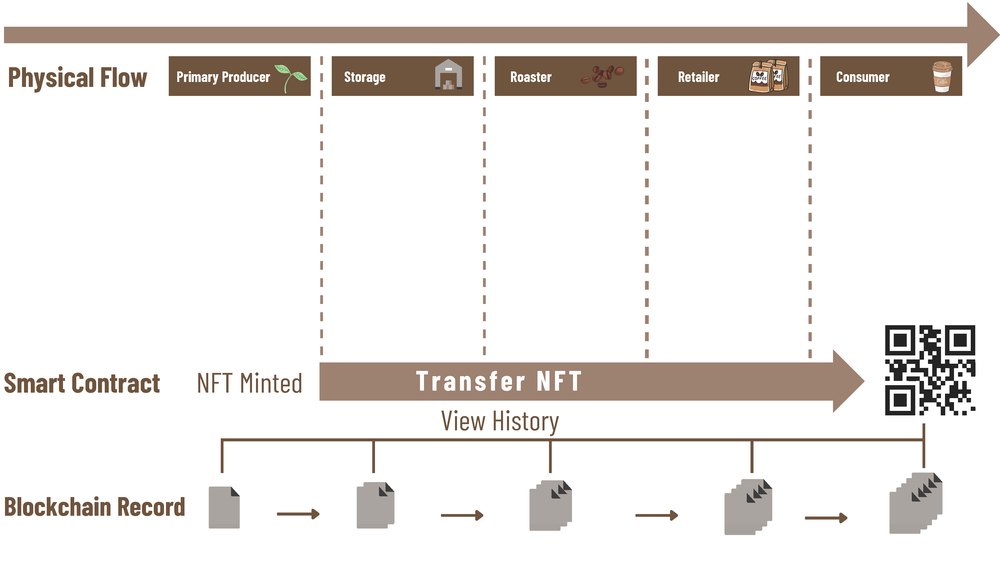
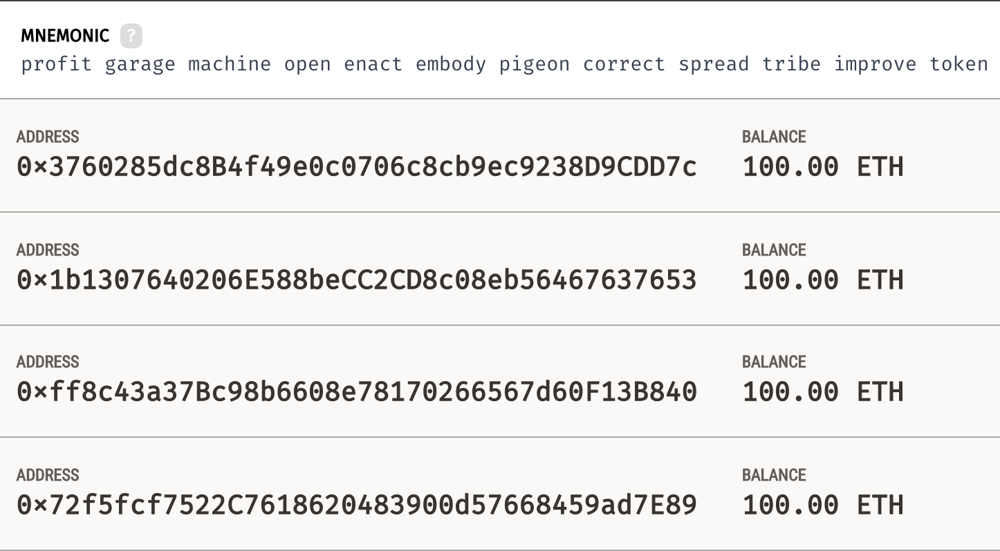
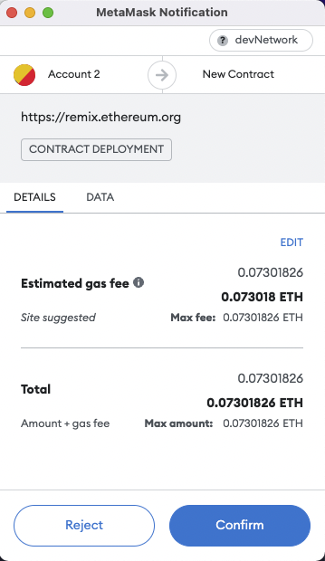
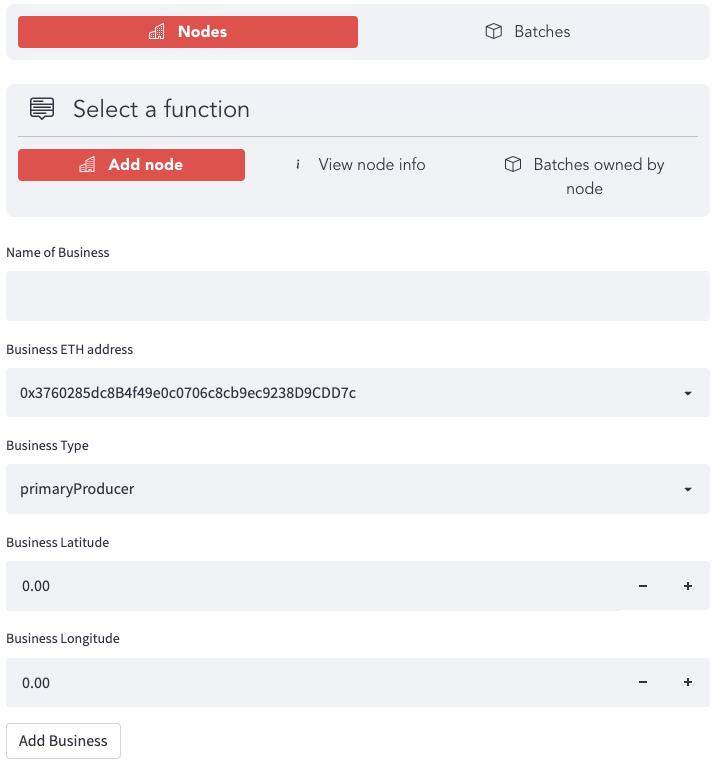
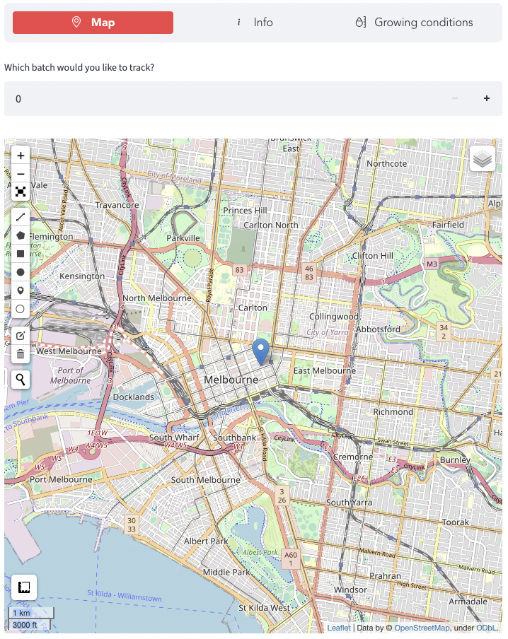

# Coffee_Supply_Chain

## Contents
1. [Overview of the Project](#overview-of-the-project)
2. [Technologies Used](#technologies-used)
3. [Getting Started](#getting-started)
    * [Installing](#installing)
4. [User Interface](#utilising-the-user-interface)

---
## Overview of the Project

This project aims to track the full supply chain from the production of coffee beans to the consumer hands utilising the capabilities of Solidity Smart Contracts, Web3 and the Ethereum Blockchain. 

Utilising a Streamlit front end this supply chain tracks the transactions and movement of coffee beans from:
* Harvester
* Storage
* Roaster
* Retailer
* Consumer

The chart below depicts the physical movement of the coffee beans from Producer to Consumer and how the transactions recorded in the Smart Contract and Blockchain run parrallel. 

## Project Goals
* Improve dissemination of information throughout the supply chain.
* Enable traceability for products that end up in the consumers hands.
* Take a step closer to an economy where stake holders have more knowledge and  control over where their money is going.

---

## Technologies Used

* [RemixIDE](https://remix-project.org/)
* [Web3](https://web3py.readthedocs.io/en/stable)
* [Streamlit](https://streamlit.io/)
* [Dotenv](https://pypi.org/project/python-dotenv/)
* [Python 3.7]()
* [QR Code](https://pypi.org/project/qrcode/)
* [Ganache](https://trufflesuite.com/ganache/)
* [Metamask](https://metamask.io/)

## Getting Started
### Installing
**A step by step series of examples on how to install this application:**

	git clone https://github.com/aaargyrou/Coffee_Supply_Chain.git

Ensure all technologies have been installed:

    pip install streamlit
    pip install streamlit-option-menu
    pip install leafmap
    pip install qrcode
    pip install web3
    pip install python-dotenv
    pip install . (from src directory)
## Install Ganache
Ganache has been used to test and validate transactions are performing correctly when using the webapp and to provide a local test net with addresses. 
Ganache can be downloaded [here](https://trufflesuite.com/ganache/).

Because this webapp has been tested with hard coded testcases, running the populate_supply_chain function requires a specific ganache workspace. This can be replicated by opening a new workspace, under accounts and keys enter the following Mnemonic: **profit garage machine open enact embody pigeon correct spread tribe improve token**

**Warning: Do not use these addresses for testnet or Mainnet ethereum addresses, this is for testing purposes only.**

The Addresses in the workspace should look as follows:

## Deploying the contract
After connecting a ganache address to metamask, the contract can be deployed on the testnet via remix and injected web3. To do this, [link ganache to metamask](https://dapp-world.com/blogs/01/how-to-connect-ganache-with-metamask-and-deploy-smart-contracts-on-remix-without-1619847868947), and import the contract.sol file into remix and deploy after compiling. If the contract does not deploy, try resetting the account in the metamask settings to get the correct nonce value.

## Environment variables
in order to initilise the SupplyChainContract, the follwoing variables should be present in a .env 
file in the main directory.

WEB3_PROVIDER_URI="GANACHE_RPC_SERVER_ADDRESS"

SMART_CONTRACT_ADDRESS="ADDRESS_OF_DEPLOYED_SMART_CONTRACT"

CONTRACT_USER_ADDRESS = "ADDRESS_USED_TO_DEPLOY_THE_CONTRACT"

OPEN_WEATHER_MAP_API_KEY = "API_KEY_FOR_OPEN_WEATHER_MAP"

## Utilising the User Interface
**A step by step series of examples on how to use this application:**

    cd app
    conda activate env
    streamlit run app.py

---
## App User Interface
User Inferface is a simple webapp that allows the user to:
* view information stored on the smart contract
* interact with the smart contract

---

The consumer view allows the user to interact and view NFT origin via map interface.

